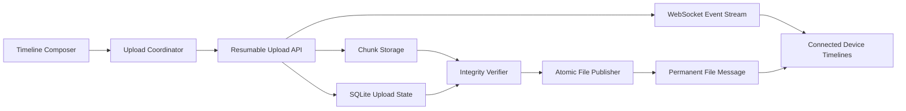
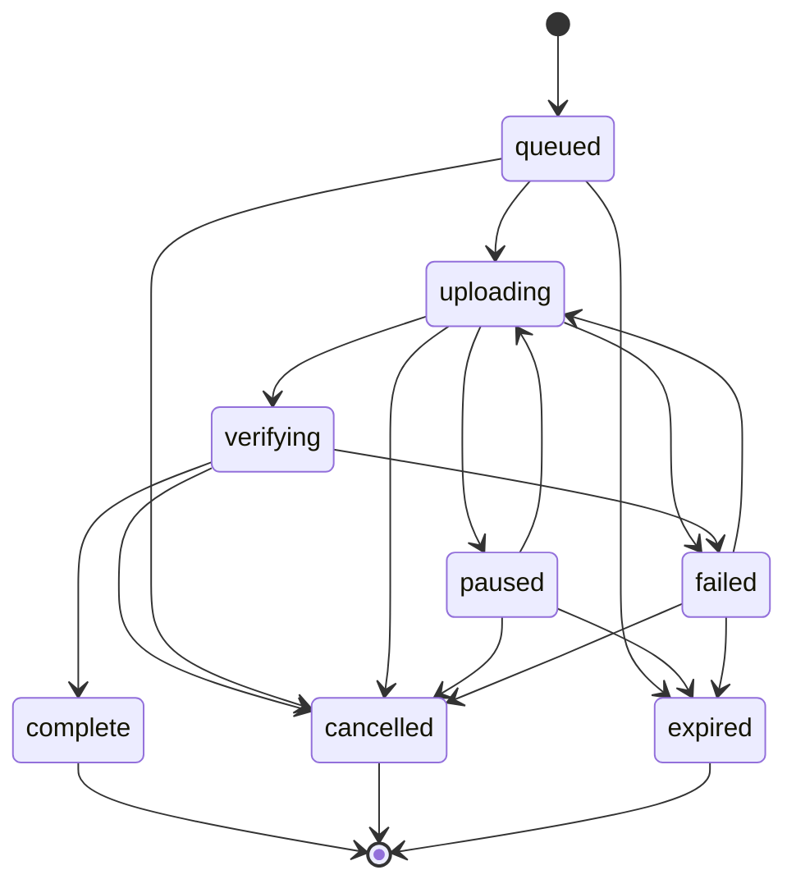

# 可恢复统一文件传输技术设计

Feature Name: `resumable-unified-transfer`
Updated: 2026-07-19

## Description

本设计把当前分离的时间线面板和上传队列改造成一个文件传输助手式工作区。每个文件从加入队列开始就是时间线卡片，卡片在原位置经历等待、上传、暂停、校验、完成或失败。后端以原生 FastAPI、SQLite 和文件系统实现可恢复分片协议，支持单文件 512MB、最多 9 个文件并行、跨刷新恢复和跨设备实时状态同步。

当前整文件上传通过一次 `multipart/form-data` 请求发送文件。新界面改用每片 8MB 的流式请求，使 40MB 及更大文件脱离单次大请求的代理与连接生命周期限制。现有 `POST /api/upload` 作为已发布 API 暂时保留，新界面不再调用该接口。

## Confirmed Decisions

- 使用时间线文件卡片布局，不保留独立上传队列面板。
- 单文件上限为 512MB。
- 最多 9 个文件同时上传，更多文件继续排队。
- 每个文件同时只发送一个分片。
- 支持单任务与全部任务的暂停、继续和取消。
- 支持跨刷新恢复；文件句柄不可用时重新选择原文件续传。
- 所有连接设备实时查看进度；源设备负责暂停和继续；所有设备可取消。
- 使用原生分片协议，不引入 tus 运行时依赖。
- 临时上传会话闲置 24 小时后过期。

## Architecture



The architecture keeps permanent messages and temporary upload sessions separate. The frontend merges both sources into one timeline projection. Completion links an upload session to one permanent message and replaces the active card by stable identity.

## Upload Lifecycle



`paused` is a server-visible state and a scheduler state. Pausing aborts or finishes the current chunk request and prevents new chunks. Confirmed chunks remain resumable. `failed` represents recoverable network, integrity, storage, publication, or re-authentication errors. `verifying` remains cancellable while assembly runs. `complete` is reachable only after whole-file verification and permanent message creation.

## Components And Interfaces

### Timeline Transfer Surface

The Transfer route becomes one visual surface containing:

- Compact connection and active-task summary.
- One scrollable timeline for messages, active upload projections, and completed files.
- One fixed or sticky composer dock.
- A full-surface drag overlay.

The upload summary is hidden when no active tasks exist. File selection, drop, and clipboard file extraction call the same `enqueueFiles()` interface. Completed cards expose existing download, locate, and delete actions.

### Upload Coordinator

Create `web/js/upload-coordinator.js` as the owner of:

- Local task identity and source-file references.
- Maximum 9-file scheduling.
- One in-flight chunk per active file.
- Pause, resume, cancel, retry, prioritize, pause-all, resume-all, and cancel-all.
- Chunk hashing and XHR progress.
- Five-second rolling speed and ETA calculation.
- Active-session reconciliation after page load or session renewal.
- File System Access handle persistence where supported.
- Reselect-and-verify fallback.

The existing composer remains responsible for text submission and delegates all file inputs to the coordinator. The coordinator emits immutable task snapshots to the timeline renderer instead of writing HTML directly.

### Upload Timeline Projection

Extend the timeline renderer with an upload-card renderer. Projection identity uses `upload_id`; the final message carries the originating `upload_id` and `client_request_id`, allowing deterministic replacement.

Source-device progress combines local XHR bytes with server-confirmed bytes. Observing devices use WebSocket progress. The live region announces state changes and coarse milestones while visual progress may update more frequently.

### Resumable Upload Service

Add an upload service responsible for state transitions, idempotency, authorization, chunk validation, completion, cancellation, and recovery. Route handlers remain thin async adapters. Blocking hashing, merging, and filesystem operations execute off the event loop with existing bounded concurrency patterns.

### Chunk Storage

Store temporary data below an isolated directory such as:

```text
UPLOAD_DIR/.resumable/<upload_id>/
  part-000000
  part-000001
  incoming-000002
```

The service derives every path from a server-generated identifier and validated numeric index. Incoming data writes to `incoming-*`; successful validation atomically renames the file to `part-*`. Completion streams ordered parts into a final `.uploading` path while calculating whole-file SHA-256, then uses the existing publish boundary.

Completion uses three phases. The begin transition acquires the per-upload lock and durably records `verifying/assembling`; bounded assembly runs outside that lock; publication and database finalization reacquire the lock. The begin mutation is broadcast before assembly starts. After assembly, completion rereads durable state under the lock and discards the pending final when cancellation or expiry won, so DELETE can complete without waiting for whole-file hashing.

An in-process complete retry enters the same durable recovery state machine used at startup. `assembling` discards the interrupted pending final, resets to `uploading`, and starts assembly again in the current request. `assembled` resumes file publication, `file_published` resumes database finalization, and `published` repairs the terminal status. Every path converges on one file and one permanent message.

When assembly identifies a missing or damaged confirmed part, `PartIntegrityError` carries its `part_index` and machine-readable `reason`. Under the upload lock, the service removes the damaged file and atomically removes its database row, recomputes `confirmed_bytes`, and transitions the session to a resumable failed state. The client can then resume and retransmit only that part.

### Recovery And Maintenance

Startup recovery reconciles SQLite and disk state:

- Delete unconfirmed `incoming-*` files.
- Preserve confirmed `part-*` files referenced by `upload_parts`.
- Mark missing confirmed parts as missing and resumable.
- Complete or compensate sessions whose final file and database state diverged.
- Expire idle sessions older than 24 hours.

The periodic maintenance loop reuses the same expiry and cleanup operation.

Cancellation commits the durable `cancelled` mutation before temporary cleanup. Cleanup failures are logged and leave the successful cancellation response unchanged; startup and periodic maintenance retry cancelled and expired residual cleanup. A successful file rename can precede persistence of `file_published`, leaving durable state at `assembled`. Terminal cleanup opens the trusted upload root with `O_DIRECTORY|O_NOFOLLOW`, atomically moves the exact final name to an unpredictable same-directory quarantine name with Linux `renameat2(RENAME_NOREPLACE)`, and opens that name with `O_NOFOLLOW`. Deletion requires a regular file with the durable size and SHA-256 plus a final device/inode/type match between the open descriptor and quarantine directory entry. Failed proof retains the quarantine object and emits a warning for investigation.

Completed messages and final files remain authoritative even when resumable-directory cleanup fails. Startup recovery retries that cleanup for complete sessions, while periodic maintenance safely scans valid non-symlink resumable directories and selects matching complete sessions without changing their message or final file. Session cleanup opens `.resumable` and every descendant relative to trusted directory descriptors, inspects entries without following symlinks, unlinks symlink entries directly, and checks directory identity before `rmdir`. Concurrent cleanup converges through idempotent missing-entry handling; replacement of a session name never redirects traversal outside the opened tree. Platforms lacking `dir_fd`, `O_NOFOLLOW`, or atomic no-replace rename support return `ENOTSUP` and defer cleanup. Every recovery change to confirmed parts, status, error code, or publication state creates its state event in the same database transaction. Lifespan broadcasts those committed mutations in global event-sequence order.

## API Design

All endpoints require the existing signed session.

### Create Or Resume Session

`POST /api/uploads`

```json
{
  "client_request_id": "uuid",
  "name": "project.zip",
  "size_bytes": 195035136,
  "mime_type": "application/zip",
  "last_modified_ms": 1784412345000,
  "chunk_size_bytes": 8388608,
  "sample_sha256": "hex"
}
```

Response:

```json
{
  "upload_id": "server-generated-id",
  "status": "queued",
  "chunk_size_bytes": 8388608,
  "confirmed_parts": [0, 1, 2],
  "confirmed_bytes": 25165824,
  "source_device_id": "device-id",
  "expires_at": "2026-07-20T12:00:00Z"
}
```

Repeated creation with matching `client_request_id` and metadata returns the same session. Metadata conflict returns `409`.

### Upload Chunk

`PUT /api/uploads/{upload_id}/parts/{part_index}`

Request headers include:

- `Content-Type: application/octet-stream`
- `Content-Range: bytes <start>-<end>/<total>`
- `X-Chunk-SHA256: <hex>`

The body is raw chunk bytes. The server streams the body, validates declared range and digest, and commits the part atomically. Identical replay returns success; conflicting replay returns `409`.

### Read And Reconcile

- `GET /api/uploads/active` returns active sessions visible in the personal workspace.
- `GET /api/uploads/{upload_id}` returns current state, confirmed parts, bytes, source device, error details, and final message when available.

### State Control

`PATCH /api/uploads/{upload_id}` accepts `{"action":"pause"}` or `{"action":"resume"}`. Pause and resume require the source device. Observing devices receive a source-device guidance response. `DELETE /api/uploads/{upload_id}` is shared-workspace cancellation and remains idempotent.

### Complete

`POST /api/uploads/{upload_id}/complete`

```json
{}
```

The server streams the confirmed parts in order, computes the complete-file SHA-256 digest, and returns the existing permanent file-message DTO. Per-part client digests already prove that published bytes match the selected source chunks, so the browser does not need to read the entire 512MB file into memory for a second whole-file digest. Repeated completion returns the same DTO.

## WebSocket Events

Add the following ordered events to the existing sequence and replay model:

- `upload.created`
- `upload.progress`
- `upload.state_changed`
- `upload.completed`
- `upload.cancelled`
- `upload.expired`

Progress events include `upload_id`, state, confirmed bytes, in-flight bytes, total bytes, source device, and update timestamp. The server emits at most four progress events per second per upload. Terminal state events bypass throttling.

## Data Models

### upload_sessions

| Column | Purpose |
|---|---|
| `id` | Server-generated upload identifier |
| `client_request_id` | Idempotency key |
| `source_device_id` | Device allowed to pause and resume |
| `original_name` | Sanitized display filename |
| `mime_type` | Declared media type |
| `size_bytes` | Declared total size |
| `last_modified_ms` | Local identity metadata |
| `sample_sha256` | Reselect identity digest |
| `chunk_size_bytes` | Negotiated chunk size |
| `status` | Upload state |
| `confirmed_bytes` | Sum of committed parts |
| `file_sha256` | Server-computed whole-file digest after verification |
| `message_id` | Permanent message after completion |
| `error_code` | Machine-readable recoverable error |
| `created_at` | Creation time |
| `updated_at` | Last activity time |
| `expires_at` | Idle-session expiry |

Unique constraints cover `client_request_id` and the final `message_id` relationship.

### upload_parts

| Column | Purpose |
|---|---|
| `upload_id` | Parent upload session |
| `part_index` | Zero-based part index |
| `start_byte` | Inclusive start offset |
| `end_byte` | Inclusive end offset |
| `size_bytes` | Confirmed part size |
| `sha256` | Confirmed part digest |
| `created_at` | Commit time |

The composite primary key is `(upload_id, part_index)`.

## Correctness Properties

1. A confirmed part corresponds to one immutable byte range and digest.
2. Confirmed byte count equals the sum of confirmed part sizes.
3. At most one scheduler request is in flight per file.
4. At most 9 files are in uploading state per source coordinator.
5. A complete upload has contiguous coverage from byte zero through `size_bytes - 1`.
6. A permanent file message references one published file and at most one upload session.
7. Replaying create, chunk, cancel, or complete operations preserves one logical result.
8. Files in incomplete sessions remain unavailable through download routes.
9. Cancelling or expiring a session eventually removes all temporary data owned by that session.
10. The event sequence remains strictly increasing across upload and existing message events.

## Error Handling

| Error | Server behavior | User experience |
|---|---|---|
| Empty or oversized file | Reject session creation | Error card with configured limit |
| Disallowed extension | Reject session creation | Error card with allowed types |
| Insufficient storage | Reject before chunk upload | Storage-capacity guidance |
| Network interruption | Keep confirmed parts | Automatic retry, then resumable failed state |
| Session authentication expiry | Return 401 | Unlock overlay, then reconcile and continue |
| Chunk range or digest mismatch | Discard incoming part | Retry affected part only |
| Reselected file mismatch | Keep session paused | Request correct original file |
| Service restart | Reconcile records and files | Restoring state, then resume |
| Merge or whole-file digest failure | Keep final file unpublished | Recoverable integrity error or cancel |
| Database publication failure | Compensate or preserve recoverable session | Publication retry state |
| Remote cancellation | Stop accepting chunks | Cancelled state on all devices |

## Security And Resource Limits

- Preserve signed-cookie session authentication and existing origin policy.
- Validate upload identifiers, indexes, ranges, sizes, digests, and state transitions.
- Enforce 512MB before receiving chunks.
- Check storage free space with a configurable reserve before session creation and completion.
- Bound active upload sessions, concurrent chunk handlers, keyed locks, and progress broadcasters.
- Stream requests and file merge operations with bounded buffers.
- Treat client MIME type and filename as metadata; continue safe download disposition and preview policy.
- Record create, complete, cancel, expiry, integrity failure, and publication compensation in audit events.

## Compatibility

The documented `POST /api/upload` endpoint remains available as a legacy whole-file path. The new Transfer UI uses only `/api/uploads*`. Legacy uploads continue creating the same permanent file-message DTO and WebSocket message events. README documentation marks the route as legacy and names migration criteria before removal.

## Test Strategy

### Unit Tests

- Upload-state transition table.
- Chunk range, size, digest, replay, and conflict validation.
- Scheduler limit, priority, pause, resume, and cancellation.
- Rolling speed and ETA calculation.
- File identity sampling and reselect validation.
- Startup and periodic cleanup reconciliation.

### API And Storage Integration Tests

- Create, upload missing parts, reconcile, complete, replay, and cancel.
- Authentication, source-device control, observing-device cancellation, and rate limits.
- Interrupted request leaves no confirmed partial part.
- Service restart preserves confirmed parts.
- Merge, digest, database failure, and disk-capacity compensation.
- Legacy `/api/upload` regression.

### Frontend Contract Tests

- Unified timeline replaces the separate queue panel.
- Full-surface drag overlay and keyboard file selection share the coordinator.
- Upload cards render every state and applicable actions.
- Live-region announcements are throttled.
- 44px controls and reduced-motion behavior.
- Refresh reconciliation and file-handle fallback.

### Browser E2E

- Multiple drop, 9 active uploads, and queued overflow.
- Individual and batch pause, resume, cancel, retry, and prioritize.
- Source and observing-device status synchronization.
- Page refresh and reselect continuation without retransmitting confirmed chunks.
- Mobile and desktop timeline geometry with composer visibility.
- 40MB upload under constrained per-request body and slow-network simulation.

### Large File Verification

Generate temporary 40MB and sparse 512MB files during tests. Verify final SHA-256 and memory bounds. Large fixtures remain outside version control.

### Regression Verification

Run the full pytest suite, frontend QuickJS contracts, Chromium E2E, Python compile check, and `git diff --check`. Existing session, WebSocket replay, message timeline, file library, download, batch download, soft delete, restore, purge, and CSP tests remain mandatory.

## References

[^1]: `web/js/composer.js:12` - Existing sequential upload queue and drag handlers.
[^2]: `web/js/api.js:122` - Existing whole-file XHR upload with local progress.
[^3]: `app/main.py:704` - Existing authenticated upload route, idempotency, locking, and event publication.
[^4]: `app/storage.py:179` - Existing streaming stage, SHA-256, size enforcement, and atomic publish boundary.
[^5]: `docs/superpowers/specs/2026-07-18-navigation-workspace-optimization-design.md:25` - Confirmed timeline-first Transfer route and responsive layout.
